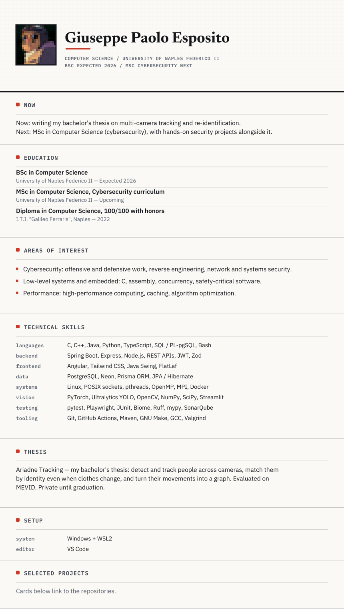
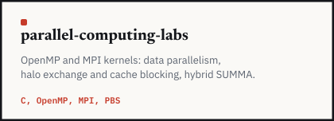
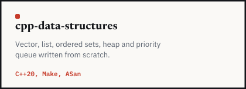
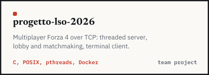
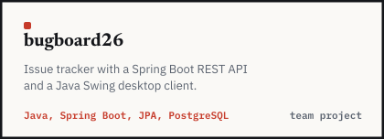
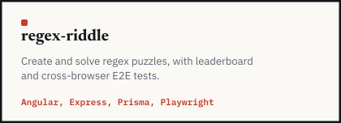
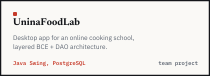
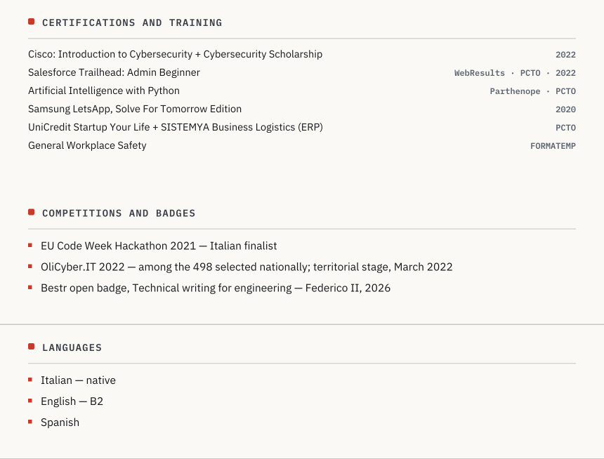
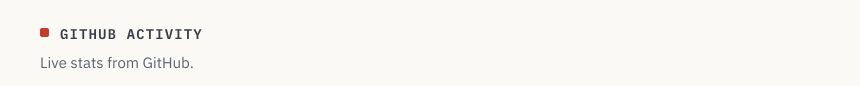

<picture><source media="(prefers-color-scheme: dark)" srcset="assets/icons/linkedin-dark.svg"></picture> [Giuseppe Paolo Esposito](https://www.linkedin.com/in/giuseppepaoloesposito/) &nbsp; <picture><source media="(prefers-color-scheme: dark)" srcset="assets/icons/mail-dark.svg"></picture> [espositogiuseppe2003@outlook.it](mailto:espositogiuseppe2003@outlook.it) &nbsp; <picture><source media="(prefers-color-scheme: dark)" srcset="assets/icons/university-dark.svg"></picture> [giuseppep.esposito@studenti.unina.it](mailto:giuseppep.esposito@studenti.unina.it)

Computer Science student at the University of Naples Federico II, interested in cybersecurity, embedded and safety-critical systems.

Open to part-time roles and collaborations.

<picture>
  <source media="(prefers-color-scheme: dark)" srcset="assets/page-dark.svg">
  
</picture>

<table>
  <tr>
    <td width="50%" align="center"><a href="https://github.com/kiyx/parallel-computing-labs"><picture><source media="(prefers-color-scheme: dark)" srcset="assets/cards/parallel-computing-labs-dark.svg"></picture></a></td>
    <td width="50%" align="center"><a href="https://github.com/kiyx/cpp-data-structures"><picture><source media="(prefers-color-scheme: dark)" srcset="assets/cards/cpp-data-structures-dark.svg"></picture></a></td>
  </tr>
  <tr>
    <td width="50%" align="center"><a href="https://github.com/virginiaesposito/progetto-lso-2026"><picture><source media="(prefers-color-scheme: dark)" srcset="assets/cards/progetto-lso-2026-dark.svg"></picture></a></td>
    <td width="50%" align="center"><a href="https://github.com/kiyx/bugboard26"><picture><source media="(prefers-color-scheme: dark)" srcset="assets/cards/bugboard26-dark.svg"></picture></a></td>
  </tr>
  <tr>
    <td width="50%" align="center"><a href="https://github.com/kiyx/regex-riddle"><picture><source media="(prefers-color-scheme: dark)" srcset="assets/cards/regex-riddle-dark.svg"></picture></a></td>
    <td width="50%" align="center"><a href="https://github.com/kiyx/UninaFoodLab"><picture><source media="(prefers-color-scheme: dark)" srcset="assets/cards/uninafoodlab-dark.svg"></picture></a></td>
  </tr>
</table>

<strong>Certifications, competitions and languages</strong>

<picture>
  <source media="(prefers-color-scheme: dark)" srcset="assets/page-2-dark.svg">
  
</picture>

<picture>
  <source media="(prefers-color-scheme: dark)" srcset="assets/activity-dark.svg">
  
</picture>

<picture>
  <source media="(prefers-color-scheme: dark)" srcset="https://github-profile-summary-cards.vercel.app/api/cards/profile-details?username=kiyx&theme=github_dark">
  
</picture>

<picture>
  <source media="(prefers-color-scheme: dark)" srcset="https://github-profile-summary-cards.vercel.app/api/cards/stats?username=kiyx&theme=github_dark">
  
</picture>
<picture>
  <source media="(prefers-color-scheme: dark)" srcset="https://github-profile-summary-cards.vercel.app/api/cards/most-commit-language?username=kiyx&theme=github_dark">
  
</picture>
<picture>
  <source media="(prefers-color-scheme: dark)" srcset="https://github-profile-summary-cards.vercel.app/api/cards/repos-per-language?username=kiyx&theme=github_dark">
  
</picture>

<picture>
  <source media="(prefers-color-scheme: dark)" srcset="https://streak-stats.demolab.com?user=kiyx&theme=github-dark&hide_border=true">
  
</picture>

